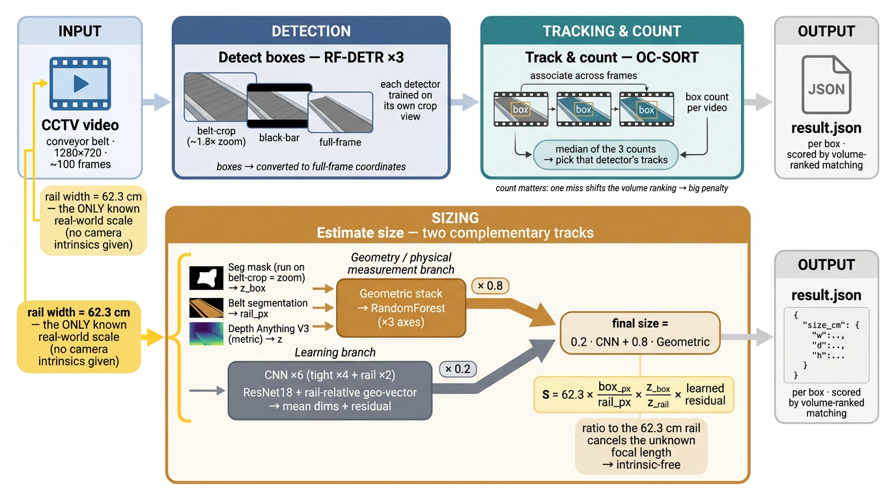

# CCTV 영상 기반 택배 상자 크기 추정



고정된 CCTV 영상에서 컨베이어를 통과하는 상자를 **검출·추적해 개수를 세고**, 각 상자의 세 변을 cm 단위로 추정하는 CJ 미래기술 챌린지 **최종 2위 솔루션**입니다.

> 결과의 `w`, `d`, `h`는 구현상 긴 변부터 짧은 변 순서로 출력됩니다. 공식 평가는 축 순열 중 오차가 가장 작은 조합을 사용합니다.

## 핵심 아이디어

단안 영상만으로 실제 크기를 구하려면 보통 초점거리 같은 카메라 내부 파라미터가 필요합니다. 이 데이터에는 카메라 정보가 없지만, 컨베이어 **레일 폭이 항상 62.3cm**라는 기준이 있습니다.

따라서 상자와 레일의 픽셀 크기를 비교하고, 단안 깊이로 두 위치의 원근 차이를 보정하면 실제 크기의 단서를 얻을 수 있습니다.

```text
크기 단서 ≈ 62.3cm × (상자 픽셀 크기 / 레일 픽셀 폭) × (상자 깊이 / 레일 깊이)
```

이 값만으로 최종 크기를 결정하지는 않습니다. 실제 구현은 레일 비율, 깊이 비율, 마스크 형상 등 **11개 기하 특징**을 축별 Random Forest에 넣고, 그 결과를 CNN 예측과 결합합니다. 즉 위 식은 파이프라인을 이해하기 위한 개념식입니다.

## 추론 파이프라인

1. **상자 검출**
   - RF-DETR 3개가 같은 프레임을 `belt-crop`, `black-bar 제거`, `full-frame`으로 각각 봅니다.
   - 크롭에서 검출한 박스는 전체 프레임 좌표로 복원합니다.

2. **추적과 개수 결정**
   - 각 검출 결과를 OC-SORT로 프레임 사이에서 연결합니다.
   - 세 검출기의 트랙 수 중 중앙값에 해당하는 검출기 하나를 고르고, 그 검출기의 트랙 전체를 사용합니다. 세 검출 결과를 박스 단위로 합치는 방식은 아닙니다.

3. **크기 추정**
   - **CNN 분기:** 트랙에서 잘 보이는 프레임 3장을 고른 뒤, tight crop 4개와 rail crop 2개 모델의 예측을 평균합니다.
   - **기하 분기:** 상자·벨트 분할과 Depth Anything V3 깊이로 11개 특징을 만들고, 축별 Random Forest 3개가 긴 변·중간 변·짧은 변을 예측합니다.
   - 최종값은 `CNN × 0.2 + 기하 × 0.8`입니다. 기하 특징을 만들지 못한 트랙은 CNN 결과만 사용합니다.

4. **결과 저장**
   - 영상별 상자 목록을 `result.json`에 저장합니다.
   - 공식 채점은 상자를 부피순으로 정렬해 비교하므로, 상자를 하나 놓치거나 중복 집계하면 뒤의 매칭까지 밀릴 수 있습니다.

이 파이프라인은 별도의 카메라 내부 파라미터를 입력받지 않습니다. 다만 그림의 “초점거리 소거”는 레일 비율과 깊이 보정에 대한 직관적인 설명이며, 실제 오차는 학습된 회귀기가 함께 보정합니다.

## 실행

### 1. 환경 설치

```bash
pip install -r requirements.txt
```

추론 의존성은 `requirements.txt`에 고정되어 있으며 GPU ONNX Runtime 환경을 기준으로 합니다.

### 2. 체크포인트 배치

체크포인트 15개는 약 1.4GB이며 GitHub 용량 제한 때문에 저장소에 포함하지 않았습니다. 실행 전 아래 구조로 `checkpoints/`에 넣어야 합니다.

```text
checkpoints/
├── det_crop.onnx
├── det_bar.onnx
├── det_full.onnx
├── f_tight_s1.onnx ... f_tight_s4.onnx
├── f_rail_s1.onnx ... f_rail_s2.onnx
├── seg_box.onnx
├── belt_seg.onnx
├── da3_metric_large.onnx
├── rf_long.onnx
├── rf_mid.onnx
└── rf_short.onnx
```

[학습 가이드](train/README.md)에는 체크포인트를 만든 전체 실험 순서가 정리되어 있습니다.

### 3. 추론 실행

```bash
python main.py --input /path/to/video_folder
```

입력 폴더의 모든 `.mp4`를 처리하고 저장소 루트에 `result.json`을 생성합니다. 다른 경로에 저장하려면 `--out`을 지정합니다.

```bash
python main.py --input /path/to/video_folder --out /path/to/result.json
```

출력 형식은 다음과 같습니다.

```json
{
  "videos": [
    {
      "video_id": "sample_001",
      "objects": [
        {"size_cm": {"w": 40.1, "d": 29.8, "h": 18.2}}
      ]
    }
  ]
}
```

## 학습과 검증

- `train/01`부터 `train/12`까지 자동 라벨링, 영상 단위 fold 생성, RF-DETR, 크기 CNN, 기하 회귀기를 순서대로 학습합니다.
- 데이터 누수를 막기 위해 프레임이 아니라 **영상 단위 5-fold**를 사용합니다.
- 평가는 실제 제출과 동일하게 검출 누락, 기하 실패 시 CNN fallback, CNN·기하 혼합까지 포함해 수행합니다.

> **재현 범위:** 공개 저장소에는 대회 원본 데이터, 1.4GB 체크포인트, WildDet3D teacher 및 일부 레거시 보조 모듈이 포함되어 있지 않습니다. 따라서 `train/`은 학습 절차와 실험을 기록한 코드이며, 저장소만 복제해 전체 체크포인트를 바로 재생성할 수 있는 상태는 아닙니다. 추론도 위 체크포인트 15개를 별도로 준비해야 합니다.

```bash
# 공식 평가 방식의 로컬 재현
python eval/scorer.py --pred result.json --gt train_label.json
```

세부 학습 명령은 [train/README.md](train/README.md), 성공·실패 실험과 데이터 누수 분석은 [docs/findings.md](docs/findings.md)에 정리되어 있습니다.

## 저장소 구조

```text
main.py                 추론 진입점
src/                    검출, OC-SORT, 크기 추정, 기하 계산
train/                  학습 파이프라인과 재현 가이드
eval/                   로컬 채점과 OOF 검증
scripts/build_submission.py
docs/findings.md        실험 및 분석 기록
```

## 구현과 그림의 대응

| 그림 | 실제 코드 |
|---|---|
| RF-DETR ×3 | `det_crop`, `det_bar`, `det_full` |
| OC-SORT | `src/ocsort.py` |
| 세 count의 median | `src/pipeline3.py`에서 중앙 트랙 수를 가진 검출기 선택 |
| CNN ×6 | tight 4개 + rail 2개 |
| Geometry ×3 axes | 11개 특징을 입력받는 축별 Random Forest 3개 |
| CNN 0.2 + Geometry 0.8 | `main.py`의 기본 `alpha_geo=0.8` |
| volume-ranked matching | 추론이 아니라 공식 평가 단계이며 `eval/scorer.py`에서 재현 |
